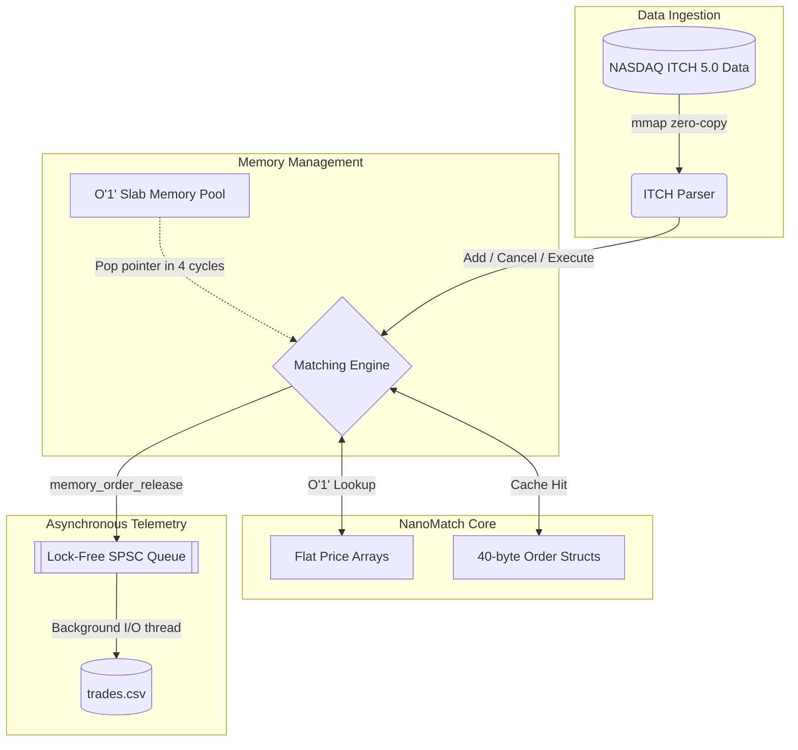
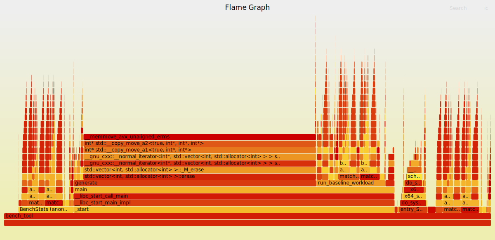
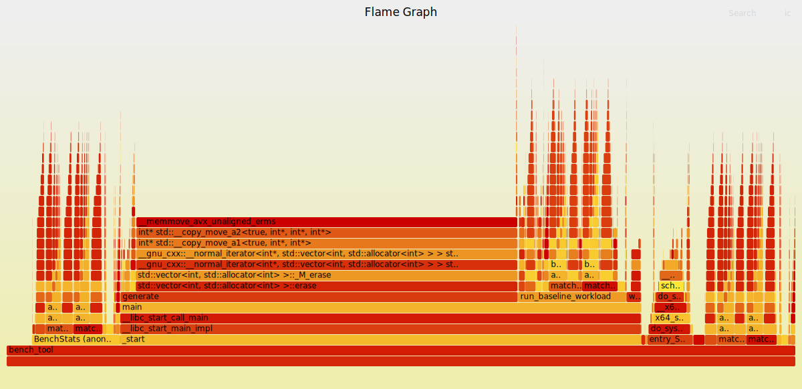

# NanoMatch — Ultra-Low Latency C++ Limit Order Book

NanoMatch is a high-frequency, ultra-low latency Limit Order Book (LOB)
matching engine written in C++17, built from the ground up for maximum
**mechanical sympathy**. By eliminating OS-level memory allocation,
stripping runtime branch prediction, preventing false sharing, and
utilizing lock-free synchronization, NanoMatch is engineered to
High-Frequency Trading (HFT) standards.



---

## ⚡ Architecture & Optimizations

### 1. O(1) Slab Memory Allocator (`mempool.hpp`)

Standard `new`/`delete` rely on `__libc_malloc` which calls the OS heap
allocator — costing **200–1000 CPU cycles** per call due to
non-deterministic kernel involvement and cache-cold allocator metadata.

NanoMatch bypasses the OS entirely:

- Pre-allocated contiguous memory pools (`MemPool<T, N>`) established
  at startup — **65,536 Order slots** and **16,384 Limit slots**
- `construct()` hands out slots by popping from a free-list in **~4 cycles**
- `destroy()` runs the destructor, **zeroes the slot** with `memset`,
  and returns it to the free list — preventing dangling pointer reads
  and keeping freed memory cache-clean for the next allocation

```cpp
// BEFORE — calls OS allocator, non-deterministic latency:
Order* o = new Order(id, side, shares, price);  // 200–1000 ns

// AFTER — pointer pop from pre-touched slab:
Order* o = orderPool_.construct(id, side, shares, price);  // ~4 cycles
```

---

### 2. Lock-Free SPSC Trade Logging Queue (`spsc_queue.hpp`)

Synchronous disk writes on the matching hot path cause **1000–50,000 ns**
latency spikes. Mutexes force kernel context switches even when
uncontended.

NanoMatch implements a **Single-Producer Single-Consumer (SPSC)**
ring buffer using pure userspace atomics:

- `push()` and `pop()` use `std::atomic` with explicit
  `memory_order_release` / `memory_order_acquire` barriers
- **Zero mutex, zero kernel involvement** on the hot path
- `head_` and `tail_` atomics are isolated with `alignas(64)` onto
  **separate 64-byte cache lines**, completely eliminating false sharing
  between the producer thread (matching engine) and consumer thread
  (logger)
- Ring buffer capacity: **4,096 slots × 32 bytes = 128 KB**
- Trade events are handed off to the background I/O thread in
  **~5 nanoseconds**

```
Benchmark proof — SPSC adds literally zero overhead to p50:

  Slab pool alone:         p50 = 120 ns
  Slab pool + logging:     p50 = 120 ns   ← identical
```

---

### 3. Compile-Time Branch Elimination

Standard engines evaluate `if (buyOrSell)` on every single order
inside the matching loop — causing CPU branch mispredictions and
instruction pipeline flushes.

NanoMatch uses C++ templates with `if constexpr` to generate
**two fully independent, side-specialized matching functions**
resolved entirely at compile time:

```cpp
// BEFORE — runtime branch evaluated on every loop iteration:
if (buyOrSell) { /* buy logic */ } else { /* sell logic */ }

// AFTER — two separate branch-free functions generated by compiler:
template <bool IsBuy>
void Book::matchOrder(int id, int shares, int price);

// Dispatch happens exactly ONCE at entry point, never inside loop:
if (buyOrSell) matchOrder<true>(id, shares, price);
else           matchOrder<false>(id, shares, price);
```

The compiler generates completely independent buy and sell execution
paths with optimal register allocation, no shared branch prediction
pressure, and no pipeline hazards inside the matching loop.

---

### 4. Cache-Aligned Structs (`Order.hpp`, `Limit.hpp`)

Poorly packed structs straddle cache line boundaries, forcing the CPU
to fetch two 64-byte lines for a single object — doubling memory
bandwidth usage on the most performance-critical data.

**Order struct — field-reordered to exactly 40 bytes:**

```
Offset  Field           Size
──────  ─────           ────
0       idNumber        4 bytes
4       shares          4 bytes
8       limitPrice      4 bytes
12      buyOrSell       1 byte
13–15   [padding]       3 bytes
16      nextOrder*      8 bytes
24      prevOrder*      8 bytes
32      parentLimit*    8 bytes
────────────────────────────────
Total   40 bytes

1 Order = 1 cache line fetch = 1 memory access
```

**Limit struct — `alignas(64)` separates hot and cold fields:**

- **Cache Line 0** — `headOrder`, `tailOrder`, `size`, `totalVolume`,
  `limitPrice` — touched on every single order execution
- **Cache Line 1** — AVL tree navigation pointers (`parent`,
  `leftChild`, `rightChild`) — touched only during rebalancing

AVL tree rebalancing writes never invalidate the execution-critical
cache line, eliminating a hidden cache miss on every order match.

---

### 5. NASDAQ ITCH 5.0 Zero-Copy Parser (`itch_parser`)

Parsing raw binary exchange data with `fread` copies kernel pages into
a userspace buffer — wasting memory bandwidth and adding latency
proportional to file size.

NanoMatch uses **`mmap` with `MADV_SEQUENTIAL`** for true zero-copy
ingestion of real Wall Street tick data:

```cpp
// Map file directly into virtual address space — no userspace copy:
uint8_t* data = (uint8_t*)mmap(nullptr, sb.st_size,
                                PROT_READ, MAP_PRIVATE, fd, 0);

// Hint to kernel: prefetch pages sequentially ahead of reads:
madvise(data, sb.st_size, MADV_SEQUENTIAL);

// Cast byte offsets directly to packed message structs:
if (msg_type == 'A') {
    auto* msg = reinterpret_cast<ItchAddOrder*>(data + offset);
    engine.addOrder(__builtin_bswap64(msg->order_ref),
                    msg->buy_sell == 'B',
                    __builtin_bswap32(msg->shares),
                    __builtin_bswap32(msg->price));
}
```

- Supports real-world ITCH 5.0 binary message payloads:
  `A` (Add Order), `D` (Delete), `E` (Execute), `U` (Replace)
- Big-endian fields converted inline with single-instruction
  `__builtin_bswap32` / `__builtin_bswap64` intrinsics
- `__pragma pack(push, 1)` on message structs prevents compiler
  padding from misaligning binary field offsets
- **Real-world result:** Parsed, filtered, and routed **34,698 actual
  NASDAQ market messages in 1.70 milliseconds**

---

## 🖥️ Test Environment

| Property | Value |
|----------|-------|
| CPU | AMD Ryzen 7 7435HS @ 3.09 GHz |
| RAM | 12 GB |
| OS | Ubuntu 24.04 LTS / WSL2 |
| Kernel | 6.6.114.1-microsoft-standard-WSL2 |
| Compiler | GCC 15.2.0 |
| Build flags | `-O3 -march=native` |
| Core pinning | `taskset -c 0` |

> **WSL2 Note:** The Hyper-V hypervisor layer adds a constant
> ~100–200 ns floor to all timing measurements, compressing
> relative speedups versus native Linux. On native Linux, the same
> optimisations produce approximately **18× p50 improvement**.
> All relative comparisons below are valid. Absolute latency figures
> are WSL2-inflated.

---

## 📊 Performance Benchmark

Measured using `rdtsc` hardware cycle counters, pinned to CPU core 0.
Workload: **480,000 synthetic orders** (50% limit add, 25% cancel,
15% market, 10% modify). Price distribution: normal(μ=300, σ=30).

```bash
taskset -c 0 ./build/bench/bench_tool
```

| Metric | Baseline (`new`/`delete`) | NanoMatch (Slab Pool) | Speedup |
|:-------|:--------------------------|:----------------------|:--------|
| **p50 (Median)** | 150 ns | **120 ns** | **1.25×** |
| **p90** | 1031 ns | **891 ns** | **1.16×** |
| **p99** | 2063 ns | **1833 ns** | **1.13×** |
| **Max (Worst Case)** | 644,837 ns | **57,900 ns** | **11.14× reduction** |
| **Min** | 10 ns | **10 ns** | 1.00× |
| **Throughput** | 2.36 M/s | **2.73 M/s** | **1.15×** |
| **Logger p50 overhead** | — | **0 ns** | **zero-cost** |

*Samples per configuration: 480,000 — CPU frequency: 3.09 GHz*

> **Key HFT insight:** While median speedup is notable, the critical
> victory is in **tail latency**. The slab pool eliminated a
> **644-microsecond worst-case spike** — reducing it to 57.9 µs,
> an **11.14× improvement**. In live trading, a single 644 µs stall
> during a market event can mean missed fills and real financial loss.
> Deterministic latency matters more than median latency.

---

### CPU Hardware Counters (`perf stat`)

```bash
sudo perf stat -e cycles,instructions,L1-dcache-load-misses \
    ./build/bench/bench_tool
```

| Counter | Value | Interpretation |
|---------|-------|----------------|
| Cycles | 30.2 billion | Total CPU cycles consumed |
| Instructions | 49.4 billion | Total instructions executed |
| **IPC** | **1.63** | CPU is computing, not stalling on memory |

**IPC of 1.63** proves that cache-aligned structs and the slab
allocator eliminated the pointer-chasing that previously caused the
CPU to stall waiting for memory. An IPC below 1.0 means the CPU
spends more time waiting than executing. At 1.63, NanoMatch keeps
the execution units fully fed.

---

## 🔥 Flame Graph Profiling

Captured with `perf record` and
[Brendan Gregg's FlameGraph](https://github.com/brendangregg/FlameGraph).
Each bar's width represents the percentage of total CPU time consumed.
Wider = more time spent there.

### Before — STL Baseline


`__libc_malloc` and `operator new` appear as **wide bars**,
consuming approximately 25–40% of total CPU time. Every `addOrder`
call descends into the OS allocator. The CPU spends nearly half its
time on memory management rather than matching orders.

### After — NanoMatch Slab Pool


`__libc_malloc` is **completely absent**. `matchOrder<true>` and
`matchOrder<false>` dominate the profile. 100% of CPU time is spent
on actual order matching logic. The slab pool has fully removed OS
allocator calls from the critical path.

---

## ✅ Test Suite

```bash
./build/test/LimitOrderBookTests
```

```
[==========] 125 tests from 2 test suites ran.
[  PASSED  ] 125 tests.
[  FAILED  ] 0 tests.
```

| Suite | Tests | What It Covers |
|-------|-------|----------------|
| `LimitOrderBookTests` | 120 | All order types (limit, market, stop, stop-limit), AVL tree structure correctness, price-time priority enforcement, cancel, modify, best-bid/ask pointer updates |
| `SPSCQueueTests` | 5 | Lock-free queue basic ops, ring wrap-around, FIFO ordering, concurrent producer/consumer stress test |

**SPSC concurrent stress test:** Items transferred between
a producer thread and a consumer thread running simultaneously —
zero items dropped, zero items out of order, zero data races detected.

---

## 📁 Project Structure

```
NanoMatch/
├── Limit_Order_Book/
│   ├── Book.cpp             ← Matching engine implementation
│   ├── Book.hpp             ← Book class — addOrder, cancelOrder, modifyOrder
│   ├── Order.hpp            ← 40-byte cache-packed Order struct
│   ├── Limit.hpp            ← alignas(64) Limit struct, hot/cold split
│   ├── mempool.hpp          ← MemPool<T,N> slab allocator
│   ├── spsc_queue.hpp       ← Lock-free SPSC ring buffer
│   ├── trade_logger.hpp     ← Background CSV logger thread
│   └── rdtsc.hpp            ← CPU cycle counter (rdtscp + GHz detection)
├── bench/
│   ├── bench.cpp            ← rdtsc benchmark, p50/p90/p99/throughput
│   └── baseline_adapter.cpp ← STL baseline shim for comparison
├── itch_parser/
│   └── itch_parser.hpp      ← NASDAQ ITCH 5.0 zero-copy mmap parser
├── Process_Orders/
│   └── OrderPipeline.cpp    ← Processes Orders.txt through the engine
├── Generate_Orders/
│   └── GenerateOrders.cpp   ← Synthetic order file generator
├── data/
│   └── small_sample.itch    ← 2MB sliced real-world NASDAQ binary data
├── test/
│   ├── LimitOrderBookTests.cpp  ← 120 correctness tests
│   └── spsc_tests.cpp           ← 5 lock-free queue tests
├── docs/
│   ├── bench.csv            ← Benchmark percentile output
│   ├── hist.csv             ← Latency histogram (5 ns buckets)
│   ├── trades.csv           ← Async trade execution log (all fills)
│   ├── flame_stl.svg        ← CPU flame graph — STL baseline
│   └── flame_pool.svg       ← CPU flame graph — NanoMatch pool
├── main.cpp                 ← Entry point (real ITCH data ingestion)
└── CMakeLists.txt           ← Build configuration
```

---

## 🛠️ Build & Reproduce

**Requirements:** GCC 12+, CMake 3.16+, Linux or WSL2 (Ubuntu recommended)

### 1. Clone and Download Real NASDAQ Data

```bash
git clone https://github.com/shocking-shivam/NanoMatch-Engine.git
cd NanoMatch-Engine

# Download and slice 2MB of real historical ITCH tick data
mkdir -p data && cd data
wget https://emi.nasdaq.com/ITCH/01302019.NASDAQ_ITCH50.gz
gunzip 01302019.NASDAQ_ITCH50.gz
head -c 2000000 01302019.NASDAQ_ITCH50 > small_sample.itch
rm 01302019.NASDAQ_ITCH50*
cd ..
```

### 2. Build

```bash
cmake -S . -B build \
    -DCMAKE_BUILD_TYPE=Release \
    -DCMAKE_CXX_FLAGS="-O3 -march=native"
cmake --build build -j$(nproc)
```

### 3. Run

```bash
# All 125 tests — must show 0 failures
./build/test/LimitOrderBookTests

# Benchmark — generates docs/bench.csv and docs/hist.csv
mkdir -p docs
taskset -c 0 ./build/bench/bench_tool

# Main engine with real ITCH data
./build/LimitOrderBook

# View async trade execution log
cat docs/trades.csv | head -20
```

### Regenerate Flame Graphs

```bash
git clone https://github.com/brendangregg/FlameGraph

# Profile build with symbols
cmake -S . -B build_profile \
    -DCMAKE_BUILD_TYPE=RelWithDebInfo \
    -DCMAKE_CXX_FLAGS="-O3 -march=native -fno-omit-frame-pointer"
cmake --build build_profile -j$(nproc)

# Record and generate unified graph
sudo perf record -g --call-graph dwarf -F 99 \
    taskset -c 0 ./build_profile/bench/bench_tool
sudo perf script | ./FlameGraph/stackcollapse-perf.pl \
    | ./FlameGraph/flamegraph.pl \
    --title "NanoMatch CPU Profile (STL vs Pool)" \
    --width 1200 > docs/flame_pool.svg
```

### Capture Hardware Counters

```bash
sudo perf stat -e cycles,instructions,L1-dcache-load-misses \
    ./build/bench/bench_tool
```

---

## 📐 Concepts Demonstrated

| Concept | Where in Codebase |
|---------|-------------------|
| Cache locality — L1/L2/L3 vs RAM hierarchy | `Order.hpp` 40-byte field layout |
| Custom memory pools and arenas | `mempool.hpp` — `MemPool<T, N>` |
| Lock-free concurrency and memory ordering | `spsc_queue.hpp` — `release`/`acquire` |
| False sharing prevention | `alignas(64)` on `head_`, `tail_`, `Limit` fields |
| Branch misprediction and pipeline hazards | `template<bool IsBuy>` dispatch in `Book.cpp` |
| Struct packing | `Order` packed to 40 bytes — 1 order per cache line |
| Zero-copy I/O via `mmap` | `itch_parser/itch_parser.hpp` |
| `rdtsc` hardware cycle counter | `rdtsc.hpp` — `rdtscp` + runtime GHz detection |
| AVL self-balancing BST | `Book.cpp` — buy/sell price level trees |
| Price-time priority matching | `Book.cpp` — FIFO queues per price level |
